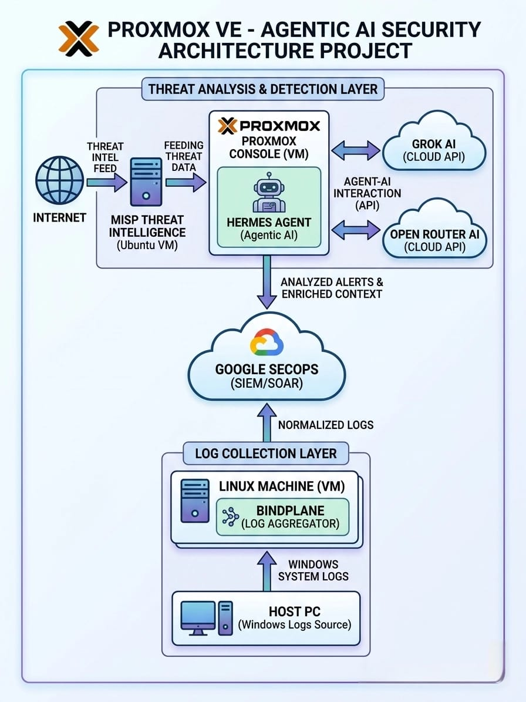

# 🛡️ Proxmox VE - Agentic AI Security Architecture

<div align="center">

[](https://www.python.org/)
[](https://www.proxmox.com/)
[](https://cloud.google.com/security/products/security-operations)
[](https://www.misp-project.org/)
[]()

**A fully autonomous, self-hosted Blue Team lab that ingests live threat intelligence, generates validated YARA-L 2 detection rules using AI, and deploys them directly into Google SecOps - all without human intervention.**

</div>

---

## 🔍 Overview

This project is a **self-hosted, agentic AI-powered security operations lab** built entirely on a **Proxmox VE hypervisor**. It demonstrates a fully automated Blue Team workflow:

1. **Threat Intelligence Ingestion** — MISP continuously pulls live threat feeds from the internet
2. **Agentic AI Analysis** — The *Hermes Agent* (a Python-driven AI agent) receives threat reports from MISP and sends them to a cloud AI (Grok AI / OpenRouter AI) for deep contextual analysis
3. **YARA-L 2 Rule Generation** — The AI synthesizes the threat data into a YARA-L 2 detection rule ready for Google SecOps
4. **Automated Validation Loop** — The rule is submitted to Google SecOps for syntax and logic validation; if errors are found, the agent autonomously re-submits back to AI for correction until the rule is clean
5. **Automated Deployment** — Once validated, the rule is deployed live into the Google SecOps environment via API
6. **Log Correlation** — Windows system logs from the Host PC are collected via BindPlane and forwarded as normalized logs to Google SecOps SIEM for correlation against deployed rules

> **This entire pipeline runs with zero manual intervention.** From a new threat indicator appearing in MISP to a deployed detection rule in SecOps — Hermes handles it all.

---

## 🏗️ Architecture Diagram

The following diagram illustrates the logical traffic flow and segmentation.

<p align="center">
  <br>
  
</p>
---

## ⚙️ How It Works

### Step-by-Step Pipeline

```
[1] MISP pulls threat intel from public/private feeds (OSINT, CIRCL, etc.)
        │
        ▼
[2] MISP generates a Threat Intel Report (IOCs, TTPs, malware hashes, IPs)
        │
        ▼
[3] Hermes Agent (hermes.py) fetches the report from MISP via REST API
        │
        ▼
[4] Hermes sends the enriched threat context to Grok AI / OpenRouter AI
        │
        ▼
[5] AI performs deep analysis and generates a YARA-L 2 detection rule
        │
        ▼
[6] Hermes submits the rule to Google SecOps Validation API
        │
        ├── ✅ Valid Rule ──► Deploy to SecOps via API  ──► [DONE]
        │
        └── ❌ Syntax/Logic Error ──► Re-send to AI with error feedback
                                          └──► Loop back to [5]
```

### Log Collection (Parallel Pipeline)

```
Host PC (Windows)
    └── Windows Event Logs / Sysmon
            └── BindPlane Agent (Linux VM)
                    └── Normalized Logs ──► Google SecOps SIEM
                                              └── Correlated against
                                                  deployed YARA-L 2 rules
```

---

## 🏗️ MISP Dashboard

Threat Intelligence Management: MISP Integration 

<p align="center">
  <br>
  
</p>
---

---

## 🛠️ Tech Stack

| Component | Technology | Role |
|---|---|---|
| **Hypervisor** | Proxmox VE 8.x | Hosts all VMs in isolated lab |
| **Threat Intel Platform** | MISP (Ubuntu VM) | Live threat feed aggregation |
| **AI Agent** | Python 3.10+ (`hermes.py`) | Agentic orchestration core |
| **AI Analysis** | Grok AI / OpenRouter AI | YARA-L 2 rule generation & validation |
| **SIEM/SOAR** | Google SecOps (Chronicle) | Rule deployment & log correlation |
| **Log Aggregator** | BindPlane (Linux VM) | Windows log collection & normalization |
| **Log Source** | Windows Host PC | Sysmon / Event logs |
| **APIs** | MISP REST API, Google SecOps API, Grok/OpenRouter API | Inter-component communication |

---

## 🖥️ Lab Environment

All components run as **isolated Virtual Machines** inside a dedicated **Proxmox VE server** in a physical lab environment.

| VM Name | OS | Role | Resources (Recommended) |
|---|---|---|---|
| `misp-vm` | Ubuntu 22.04 LTS | MISP Threat Intelligence | 4 vCPU / 8 GB RAM / 100 GB |
| `hermes-vm` | Ubuntu 22.04 LTS | Hermes Agentic AI Agent | 2 vCPU / 4 GB RAM / 50 GB |
| `bindplane-vm` | Ubuntu 22.04 LTS | BindPlane Log Aggregator | 2 vCPU / 4 GB RAM / 50 GB |
| Host PC | Windows 10/11 | Log Source (Sysmon) | Physical Host |

> **Network:** All VMs communicate over an internal Proxmox bridge (`vmbr0`). Outbound internet access is allowed for MISP feeds and cloud AI APIs.

---

## 📁 Project Structure

```
proxmox-agentic-ai-security/
│
├── 📄 README.md                        # This file
│
├── 🤖 hermes_agent/
│   ├── run_script
│   └── hermes.py                       # Main Hermes Agent script (core)
│
├── 🖥️ infrastructure/
│   ├── bindplane/
│   │   ├── bindplane-install.sh        # BindPlane install script
│   │   └── bindplane-config.yaml       # BindPlane collector config
│   └── windows/
│       └── sysmon-config.xml           # Sysmon configuration for Host PC
│
└── 📊 assets/
    ├── MISP dashboard.png
    └── architecture-diagram.jpeg        # Project architecture diagram
```

---

## 🚀 Setup & Configuration

### Prerequisites

- Proxmox VE 8.x server (physical or nested)
- Google SecOps (Chronicle) account with API access
- Grok AI API key **and/or** OpenRouter AI API key
- Python 3.10+ on the Hermes VM
- Internet access for MISP feeds and cloud AI APIs

---

### 1. MISP Setup (Ubuntu VM)

```bash
# Clone MISP installer
git clone https://github.com/MISP/MISP.git /opt/MISP

# Run automated install (Ubuntu 22.04)
cd /opt/MISP/INSTALL
bash INSTALL.sh

# After installation, configure feeds via the MISP web UI:
# Administration > Feeds > Add Default Feeds
# Enable: CIRCL, Botvrij, ESET, Abuse.ch, etc.
```

---

### 2. BindPlane Log Aggregator Setup (Linux VM)

```bash
# Install BindPlane agent
curl -fsSlL https://github.com/observIQ/bindplane-agent/releases/latest/download/install_unix.sh | bash

# Copy the configuration
cp infrastructure/bindplane/bindplane-config.yaml /etc/bindplane/config.yaml

# Enable and start the service
systemctl enable --now bindplane-agent
```

Configure the Windows Host PC with **Sysmon** using the provided config:

```powershell
# On the Windows Host PC (run as Administrator)
sysmon64.exe -accepteula -i infrastructure\windows\sysmon-config.xml
```

---

## 🤖 Hermes Agent — Core Script

`hermes.py` is the **brain of the entire pipeline**. It orchestrates all components autonomously:

```python
# Simplified flow of hermes.py

while True:
    # 1. Poll MISP for new threat events
    threat_reports = misp_client.get_new_events()

    for report in threat_reports:
        # 2. Enrich and send to AI for YARA-L 2 rule generation
        yara_rule = ai_client.generate_yara_rule(report)

        # 3. Validate rule — retry loop with AI correction
        max_retries = 5
        for attempt in range(max_retries):
            validation = secops_client.validate_rule(yara_rule)

            if validation.is_valid:
                # 4. Deploy the rule to Google SecOps
                secops_client.deploy_rule(yara_rule)
                logger.info(f"Rule deployed successfully: {yara_rule.name}")
                break
            else:
                # 5. Send error feedback back to AI for correction
                yara_rule = ai_client.fix_rule(yara_rule, validation.errors)

    time.sleep(config.POLL_INTERVAL)
```

---

## 🔄 AI Rule Generation Pipeline

The AI prompt to Grok / OpenRouter is carefully engineered to produce valid YARA-L 2 rules:

```
System Prompt:
  You are an expert Google SecOps detection engineer.
  Given a MISP threat intelligence report, generate a syntactically correct
  YARA-L 2 rule for Google SecOps Chronicle SIEM. The rule must:
    - Use proper YARA-L 2 syntax
    - Target the relevant UDM (Unified Data Model) fields
    - Include meaningful metadata (author, severity, reference)
    - Be optimized for performance
  Return ONLY the rule. No explanation. No markdown fences.

User Prompt:
  Threat Report: {misp_event_json}
```

If validation fails, the correction prompt includes the exact error:

```
The following YARA-L 2 rule has a validation error:
  Rule: {rule_text}
  Error: {validation_error_message}

Fix the rule and return only the corrected version.
```

---

## 🔑 Environment Variables

Copy `.env.example` to `.env` and fill in your values:

```env
# MISP Configuration
MISP_URL=https://<your-misp-instance>
MISP_API_KEY=<your-misp-api-key>
MISP_VERIFY_SSL=false

# AI Provider — choose one or both (Hermes will use fallback)
GROK_API_KEY=<your-grok-api-key>
GROK_API_URL=https://api.x.ai/v1

OPENROUTER_API_KEY=<your-openrouter-api-key>
OPENROUTER_API_URL=https://openrouter.ai/api/v1
AI_MODEL=anthropic/claude-3.5-sonnet   # or any OpenRouter model

# Google SecOps (Chronicle)
SECOPS_PROJECT_ID=<your-gcp-project-id>
SECOPS_CUSTOMER_ID=<your-chronicle-customer-id>
SECOPS_SERVICE_ACCOUNT_JSON=config/secops-service-account.json

# Hermes Agent Settings
POLL_INTERVAL_SECONDS=300
MAX_RULE_RETRY_ATTEMPTS=5
LOG_LEVEL=INFO
```

---

### Sample Output

```bash
/root/hermes-agent/hermes-env/bin/python3 /root/hermes-agent/hermes.py
```

```
2026-05-21 00:16:20  INFO      hermes — ══════════  HERMES AUTONOMOUS SOC AGENT — START  ══════════
2026-05-21 00:16:20  INFO      hermes — Stage 1 — Fetching detection data from Chronicle SIEM (log_type=FORTINET_FORTIANALYZER)
2026-05-21 00:16:20  INFO      hermes — Selected rule match: 'fortinet_configuration_change'  |  Severity: MEDIUM  |  Priority: Medium  |  Phase: Testing
2026-05-21 00:16:20  DEBUG     hermes — Detection summary:
Rule: fortinet_configuration_change
Author: Hermes Autonomous SOC  |  Version: 1.0  |  Tags: T1543
Description: Detects configuration changes on a FortiGate device such as firewall policy edits.
Match Window: 30 minutes
Event Type: STATUS_UPDATE
Log Source: FORTINET_FORTIANALYZER

Matched Events:
  - [event_type]   STATUS_UPDATE
  - [description]  Configuration changed
  - [description]  Object attribute configured
  - [user]         admin@corp.local
  - [hostname]     FGT-CORE-01.internal.corp

Outcome Values:
  - [principal_user]      ["admin@corp.local"]
  - [principal_hostname]  ["FGT-CORE-01.internal.corp"]
  - [change_count]        7

False Positive Likelihood: Medium
MITRE ATT&CK Reference: T1543 — Create or Modify System Process

============================================================
rule fortinet_configuration_change {
  meta:
    author = "Hermes Autonomous SOC"
    version = "1.0"
    description = "Detects configuration changes on a FortiGate device such as firewall policy edits."
    created = "2026-05-21"
    severity = "MEDIUM"
    priority = "Medium"
    false_positives = "Medium"
    tags = "T1543"
    phase = "Testing"

  events:
    $e.metadata.log_type = "FORTINET_FORTIANALYZER"
    $e.metadata.event_type = "STATUS_UPDATE"

    (
      $e.metadata.description = "Configuration changed" or
      $e.metadata.description = "Object attribute configured"
    )

    $e.principal.user.userid = $user
    $e.principal.hostname = $hostname

  match:
    $user, $hostname over 30m

  outcome:
    $principal_user = array_distinct($user)
    $principal_hostname = array_distinct($hostname)
    $change_count = count($e.metadata.id)

  condition:
    $e
}
============================================================
```

---

## 🗺️ Roadmap

- [x] MISP threat intelligence ingestion
- [x] Hermes agentic AI orchestration (hermes.py)
- [x] YARA-L 2 rule generation via Grok AI / OpenRouter AI
- [x] Google SecOps validation loop with auto-correction
- [x] Automated rule deployment to Google SecOps
- [x] BindPlane log collection (Windows → SecOps)

---

## 🤝 Contributing

Contributions, issues, and feature requests are welcome!

1. Fork the repository
2. Create a feature branch: `git checkout -b feature/your-feature`
3. Commit your changes: `git commit -m 'feat: add your feature'`
4. Push to the branch: `git push origin feature/your-feature`
5. Open a Pull Request

---

## ⚠️ Disclaimer

This project is intended for **educational and authorized Blue Team lab use only**. All threat intelligence processing and rule deployment should only be performed on systems you own or have explicit written permission to test. The author is not responsible for any misuse of this project.

---

<div align="center">

**Built with 🛡️ for the Blue Team community**

*Self-hosted · AI-Powered · Fully Automated*

</div>
